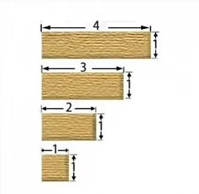

看到一个智力题目，图片如下， 

怎样将这四个木块拼一个正方形:想了一会儿，如何才能拼凑一起，  
简单计算一下它们的各边长，用笔画了一会，貌似怎么也拼不出正方形，再或许是我的打开方式不对呢？  
后来发现，四个木块的宽都是1，围起来便是一个正方形了。  
有时候我们的思维被一种定向的方式所牵引，而且这种牵引力随着我们了解的知识增加而变大，感觉以前中学时代的发散思维只是一个幌子，只是让我们按照别人的思维方式走下去，最后没有人“走自己的路”。  
前段时间，铁道部门发布了一个新的消息，火车启动前24小时退票要额外收取票价20%的手续费（以前是5%）。听到这个消息，我非常的不开心，在不能说脏话的前提下，感觉无话可说了，和老贺讨论了一下这个问题，一直充斥着抱怨与无赖，政策的无能和剥削。第二天，新闻上面报道称聪明的网友想到一个法子，先改签，然后再退票，因为改签的手续费没有变动，这样会节省一笔费用。听到这个消息，我愣住了，不是为了票价，而是自己，为什么我就没有想到呢，遇到心烦的事情大脑就像短路了一样，不能控制自己的愤怒而丧失了思维能力，自己很难驾驭这一点，导致很多事情都与自己背道而驰，事倍功半，这样真的不好！
